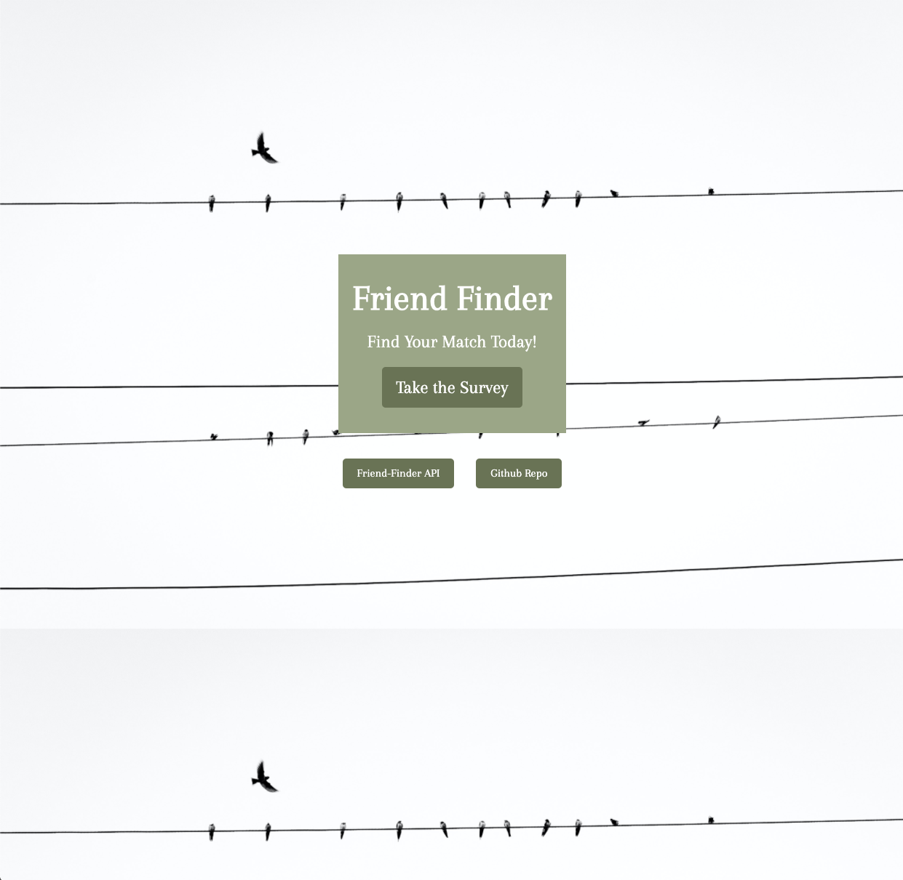

# FriendFinder App

Always wondering what a great match in a friend would be like? Well, if you're an animal lover and looking for friend in an animal, you've come to the right place!

## Live Link

https://sleepy-scrubland-33243.herokuapp.com/

## How to Use

You will need to take an ordinary survey of questions to allow Friend Finder to get to know you and pick the perfect match for you. Select a number that ranges between 1 through 5, 1 being the least and 5 being the strongest. Once you've finished your survey, a friend match will appear!

#### Home page that displays the buttons to the survey, API links, and Github Repo

#### Parsed JSON that displays hardcoded friends data

#### Survey the user takes to get a new match and furry friend!

#### Results show an image + name of new furry friend in a modal after user fills out survey and clicks submit.

## Technologies Used

- Javascript
- jQuery
- node.js
- Express.js
- SASS
- HTML

## Code Logic

- NPM install the packages
- Use server.js to run the code in your terminal via Node.js, simply put 'nodemon' in the terminal.
  - This in result sets up and runs the Express.js server
- Two HTML files are housed in the public folder that serve as the front-end section of the application (home.html and survey.html)
  - One Javascript file in the public folder serves the modal in which presents the friend match. (modal.js)
- Two routes that lead to the back-end of the application: htmlRoutes and apiRoutes. htmlRoutes displays the both the homepafe and survey based on the URL routes. apiRoutes leads us to the content in which holds our exsisting friends and new friends (user input)
- Data is the hardcoded friends in the data folder in which is created to match each new friend that has been inputted by the user.
